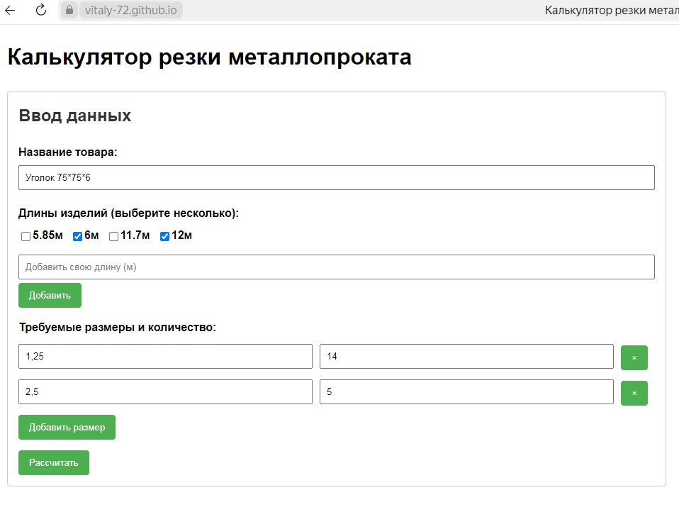
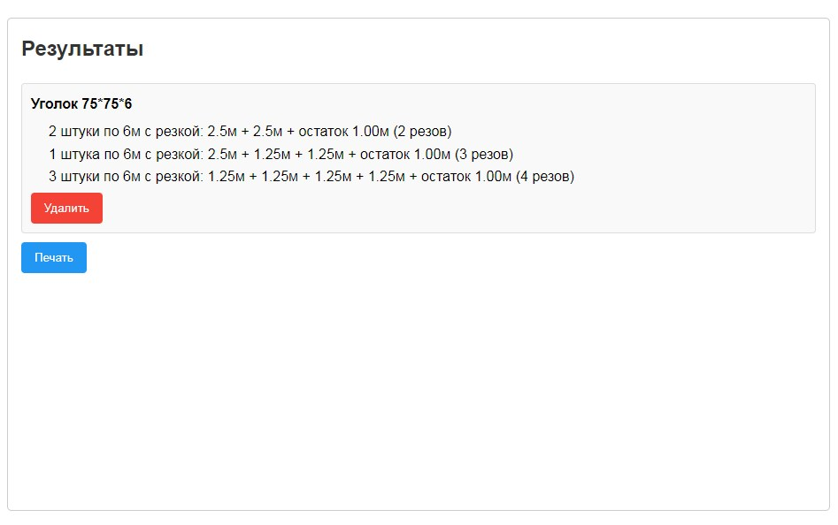

# Калькулятор резки металлопроката

## Описание

Это веб-приложение для расчета оптимального раскроя металлопроката (уголков, труб, швеллеров и т.д.) на заготовки нужных размеров с минимальными отходами.

 
## Основные функции

- Расчет количества стандартных заготовок для выполнения заказа
- Оптимизация раскроя с минимальными отходами
- Поддержка пользовательских длин заготовок
- Генерация карты раскроя для печати
- Учет количества резов для каждой заготовки

## Как использовать

1. Введите название металлопроката (например: "Уголок 50×50")
2. Выберите доступные стандартные длины или добавьте свои
3. Укажите требуемые размеры и количество деталей
4. Нажмите "Рассчитать" для получения оптимального плана раскроя
5. При необходимости распечатайте результаты

## Алгоритм работы

Приложение использует алгоритм First-Fit Decreasing (FFD) для решения задачи упаковки в контейнеры (bin packing problem), что позволяет минимизировать отходы металла при резке.

## Технологии

- HTML5
- CSS3
- JavaScript (чистый JS без зависимостей)

## Лицензия

© [Год] [Ваше имя или название организации]. Все права защищены.

Этот проект распространяется под проприетарной лицензией (All Rights Reserved). 
Использование, модификация и распространение кода запрещены без письменного разрешения автора.
